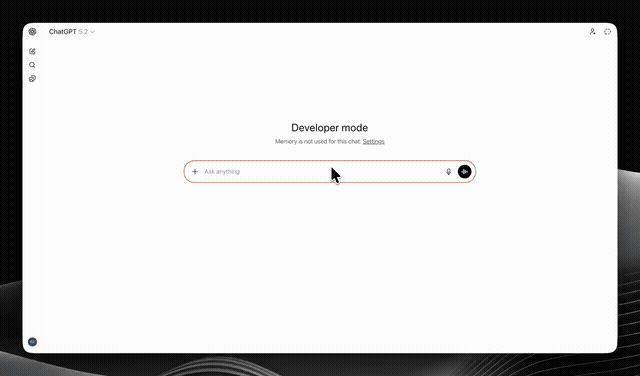
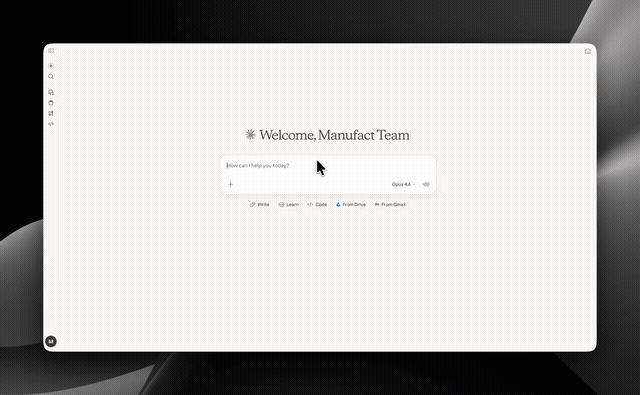

<p align="center">
  
</p>

# Remotion MCP App

An [MCP App](https://mcp-use.com) for AI-powered video creation. It combines an MCP server with an interactive widget — the model writes React/[Remotion](https://remotion.dev) code, the server compiles it in real-time, and a live video player renders the result directly inside the chat.

Unlike a standard MCP server that only returns text, an **MCP App** bundles a full UI widget alongside its tools. The Remotion Player widget renders inline in any compatible client (ChatGPT, Claude, or custom apps built with [mcp-use](https://mcp-use.com)), giving the model a visual canvas it can iterate on.

## Try it now

Connect any MCP-compatible client to the hosted instance:

```
https://still-feather-l5mwy.run.mcp-use.com/mcp
```

Works with ChatGPT, Claude, or any client that supports [MCP Apps](https://mcp-use.com).

## Demos

### ChatGPT + Remotion MCP App

[](https://github.com/mcp-use/remotion-mcp-app/releases/download/v1.0.0/openairemotion.mp4)

### Claude + Remotion MCP App

[](https://github.com/mcp-use/remotion-mcp-app/releases/download/v1.0.0/ClaudeRemotionDemo.mp4)

> Click the previews above to watch the full demos.

## How it works

This is an **MCP App** — an MCP server paired with a UI widget. The two pieces work together:

1. **MCP Server** -- exposes `create_video` tool + rule tools for teaching Remotion patterns
2. **Widget** -- a Remotion Player that renders inline in the chat, receives compiled bundles from the server

The flow:

1. The model calls `create_video` with React/Remotion source files
2. The server compiles the project with esbuild (sub-second)
3. The compiled bundle is sent back as `structuredContent`, and the widget renders it as a playable video
4. For edits, the model calls `create_video` again with only changed files -- the widget updates in-place with a loading overlay

```
Model                    MCP App (Server + Widget)
  |                          |
  |-- create_video({files}) ->|
  |                          |-- esbuild compile
  |<- structuredContent -----|
  |                          |-- Widget renders video inline
  |                          |
  |-- create_video({edits}) ->|
  |                          |-- merge + recompile
  |                          |-- Widget updates in-place
```

### Single tool design

There is one tool: `create_video`. It handles both creation and editing. The `files` parameter is always required -- for edits, only send changed files. The server merges them with the previous session state.

### Rule tools

The server includes teaching tools derived from the [remotion-best-practices](https://github.com/remotion-dev/skills) skill that the model can call to learn Remotion patterns:

| Tool | Topic |
|------|-------|
| `rule_react_code` | Project structure, imports, entry file contract |
| `rule_remotion_animations` | `useCurrentFrame`, frame-driven animation |
| `rule_remotion_timing` | `interpolate`, `spring`, `Easing` configs |
| `rule_remotion_sequencing` | `Sequence`, scene management, duration |
| `rule_remotion_transitions` | `TransitionSeries`, fade, slide, wipe |
| `rule_remotion_text_animations` | Typewriter effect, word highlighting |
| `rule_remotion_trimming` | Trimming with negative `Sequence` from |

### Widget (the "App" part)

The Remotion Player widget is what makes this an MCP App rather than a plain MCP server. It runs inside the chat interface and features:

- Live video playback with controls
- Animated loading state with shader gradient while the model writes code
- Editing overlay (blur + gradient) when updating an existing video
- Fullscreen mode
- Error display with compilation error details

## Local development

### Prerequisites

- Node.js 18+
- npm or pnpm

### Setup

```bash
git clone https://github.com/mcp-use/remotion-mcp-app.git
cd remotion-mcp-app
npm install
npm run dev
```

The server starts at `http://localhost:3000/mcp`.

### Connect a client

Point any MCP client at `http://localhost:3000/mcp`. For example with [mcp-use](https://mcp-use.com):

```json
{
  "mcpServers": {
    "remotion": {
      "url": "http://localhost:3000/mcp"
    }
  }
}
```

### Build and deploy

```bash
npm run build
npm run deploy
```

## Project structure

```
index.ts                     -- MCP server, tool definitions, handler
utils.ts                     -- esbuild compilation, session state, response helpers
types.ts                     -- Shared types (VideoProjectData, VideoMeta)
rules/                       -- Remotion teaching content served by rule tools
resources/remotion-player/   -- Widget source (React + Remotion Player)
  widget.tsx                 -- Main widget component
  components/
    CodeComposition.tsx      -- Bundle compiler (eval + runtime shim)
```

## Tool schema

```typescript
create_video({
  files: string,            // REQUIRED -- JSON string of {path: code}
  entryFile?: string,       // Default: "/src/Video.tsx"
  title?: string,
  durationInFrames?: number, // Default: 150
  fps?: number,             // Default: 30
  width?: number,           // Default: 1920
  height?: number,          // Default: 1080
})
```

The `files` parameter is a JSON string mapping virtual file paths to source code:

```json
{
  "/src/Video.tsx": "import {AbsoluteFill} from \"remotion\";\nexport default function Video() { return <AbsoluteFill />; }"
}
```

## Session behavior

- Each MCP session maintains its own project state
- Calling `create_video` merges new files with the previous project
- Metadata (title, fps, dimensions) carries forward unless overridden
- Sessions are capped at 250 concurrent projects with LRU eviction

## License

MIT -- see [LICENSE](LICENSE) for details.

Note: [Remotion](https://remotion.dev) is a dependency with its own license. Free for individuals and companies with up to 3 employees. Larger organizations need a [company license](https://www.remotion.pro/license).

---

Built with [mcp-use](https://mcp-use.com) and [Remotion](https://remotion.dev). Rule tools adapted from the [remotion-best-practices](https://github.com/remotion-dev/skills) skill by Remotion.
